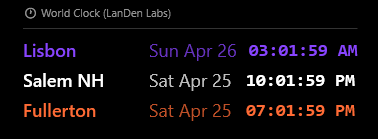
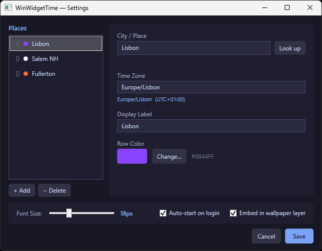
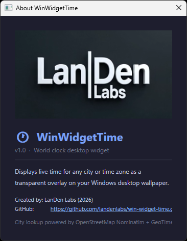

<table border="0">
  <tr>
    <td>
      3-Apr-2026<br>
      Windows<br>
      <a href="https://landenlabs.com/android/index.html">Home</a>
    </td>
    <td>
      <a href="https://landenlabs.com/android/index.html">
        
      </a>
    </td>
  </tr>
</table>

# WinWidgetTime

[](https://github.com/landenlabs/win-widget-time/actions/workflows/build.yml)


A lightweight, transparent **World Clock desktop widget** for Windows 11. Displays live time for multiple cities as a semi-transparent overlay directly on your desktop wallpaper.

**By [LanDen Labs](https://github.com/landenlabs) (2026)**

---

## Screenshots

**Example on Desktop**



**Settings dialog**



**About dialog**



---

## Features

- **Multi-city clock** — display time for any number of cities simultaneously
- **Transparent overlay** — sits directly on the desktop wallpaper, no taskbar clutter
- **Live updates** — time refreshes every second
- **Per-city colors** — assign a custom color to each city row
- **City lookup** — search by city name via OpenStreetMap Nominatim (auto-populates timezone)
- **Drag to reposition** — click and drag the widget anywhere on the desktop
- **Drag to reorder** — reorder cities in the settings list via drag handle
- **12 or 24-hour format** — configurable date and time display formats
- **Auto-start on login** — optional Windows startup via registry
- **Wallpaper embed mode** — render the widget at the wallpaper layer (below all windows)
- **Animated logo** — company logo plays on the About dialog (MP4 with PNG fallback)

---

## Requirements

- Windows 10 / 11
- [.NET 8.0 Desktop Runtime](https://dotnet.microsoft.com/en-us/download/dotnet/8.0)

---

## Installation

### Option A — Download release zip

1. Go to [Releases](https://github.com/landenlabs/win-widget-time/releases)
2. Download `WinWidgetTime.zip`
3. Extract to any folder (e.g. `C:\opt\bin\winwidgets\`)
4. Run `WinWidgetTime.exe`

### Option B — Build from source

```cmd
git clone https://github.com/landenlabs/win-widget-time.git
cd win-widget-time
install.bat
```

The `install.bat` script publishes the project and copies the output to `C:\opt\bin\winwidgets\`.

---

## Usage

### Widget controls

| Action | Result |
|--------|--------|
| **Hover** | Reveals ⚙ Settings and ? About buttons |
| **Drag** | Repositions the widget on the desktop |
| **Right-click** | Opens context menu (Settings / About / Exit) |

### Context menu

```
⚙  Settings
?  About
───────────
✕  Exit
```

---

## Settings

Open Settings via the hover button or right-click menu.

### Places list (left panel)

- **Add / Delete** cities using the buttons below the list
- **Drag** the grip handle (⠿) to reorder
- **Click** a city to edit it in the right panel

### Edit panel (right panel)

| Field | Description |
|-------|-------------|
| City / Place | City name — press Enter or click **Look up** to auto-fill timezone |
| Time Zone | IANA timezone ID (e.g. `America/New_York`) — auto-filled by lookup |
| Display Label | The label shown in the widget for this city |
| Row Color | Per-city color swatch — click to open the color picker |

### Global settings (bottom strip)

| Setting | Description |
|---------|-------------|
| Font Size | Slider 10–36px |
| Auto-start on login | Adds WinWidgetTime to Windows startup |
| Embed in wallpaper layer | Renders widget below all windows at the wallpaper level |

Settings are saved to `%APPDATA%\WinWidgetTime\settings.json`.

### Default cities

| City | Timezone | Color |
|------|----------|-------|
| New York | America/New_York | `#00FF88` |
| London | Europe/London | `#88AAFF` |
| Tokyo | Asia/Tokyo | `#FFAA44` |

---

## Building from Source

### Prerequisites

- [.NET 8 SDK](https://dotnet.microsoft.com/en-us/download/dotnet/8.0)
- Windows (WPF requires a Windows build host)

### Build

```cmd
dotnet build WinWidgetTime.csproj -c Release
```

### Publish (framework-dependent, minimum file set)

```cmd
dotnet publish WinWidgetTime.csproj -c Release --self-contained false
```

Output: `bin\Release\net8.0-windows\publish\`

### Build and install via batch script

```cmd
install.bat
```

Kills any running instance, publishes, and copies all files to `C:\opt\bin\winwidgets\`.

---

## Project Structure

```
WinWidgetTime/
├── Models/
│   ├── AppSettings.cs       # Settings data model
│   └── PlaceEntry.cs        # Per-city data model
├── Services/
│   ├── AutoStartService.cs  # Windows registry startup
│   ├── DesktopService.cs    # Wallpaper embed mode
│   ├── GeocodingService.cs  # OpenStreetMap city lookup
│   └── SettingsService.cs   # Load/save settings.json
├── ViewModels/
│   └── TimeDisplayItem.cs   # Live time binding per city
├── Windows/
│   ├── AboutWindow.xaml     # About dialog
│   ├── ColorPickerWindow.xaml
│   └── SettingsWindow.xaml  # Settings dialog
├── Assets/
│   ├── landen_labs.mp4      # Animated logo (About dialog)
│   └── landenlabs.png       # Static logo fallback
├── MainWindow.xaml          # Main widget overlay
└── install.bat              # Build and install script
```

---

## Credits

| Component | Source |
|-----------|--------|
| City geocoding | [OpenStreetMap Nominatim](https://nominatim.openstreetmap.org/) |
| Timezone lookup | [GeoTimeZone](https://github.com/mattjohnsonpint/GeoTimeZone) |
| Timezone conversion | [TimeZoneConverter](https://github.com/mattjohnsonpint/TimeZoneConverter) |
| Timezone data | [IANA TZDB](https://www.iana.org/time-zones) |

---

## License

MIT © [LanDen Labs](https://github.com/landenlabs) 2026
